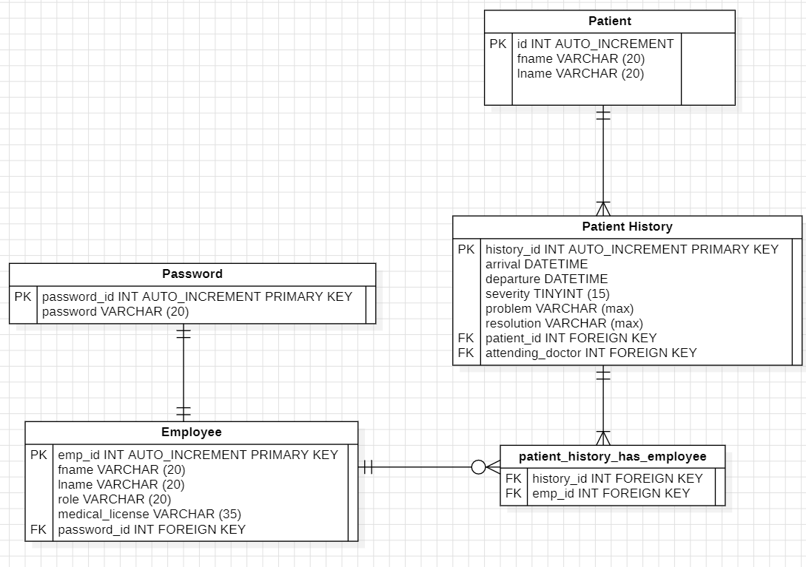

# Database Layout

What will the database be tracking?
 - patient information
 - patient histories (includes current admissions. will be identified by a lack of departure time)
 - employee information
 - passwords for employees

## Entities

#### Patient
  - p_id INT AUTO_INCREMENT PRIMARY KEY
  - fname VARCHAR(20)
  - lname VARCHAR(20)

#### Patient History
  - h_id INT AUTO_INCREMENT PRIMARY KEY
  - arrival DATETIME
  - departure DATETIME
  - severity TINYINT(15)
  - problem VARCHAR(max)
  - resolution VARCHAR(max)
  - p_id FOREIGN KEY

#### Employee
  - fname VARCHAR(20)
  - lname VARCHAR(20)
  - role VARCHAR(20)
  - medical_license VARCHAR(35)
  - p_id INT FOREIGN KEY

#### Passwords
 - password_id INT AUTO_INCREMENT PRIMARY KEY
 - password VARCHAR(25)

### ERD

